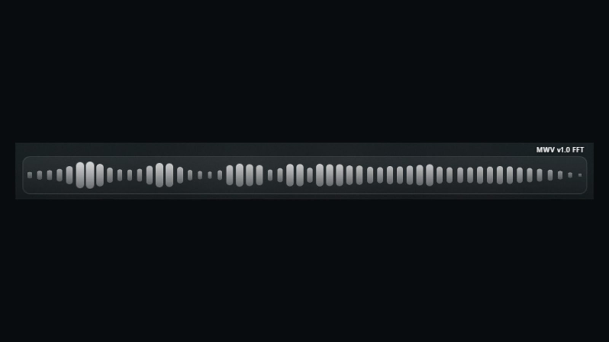

# Minimal Wave Visualizer



A minimal, full-width 56-band spectrum for Spicetify with true sub-bass motion and a cinematic glass pressure wave. Bars stay responsive across bass, mids, and highs; sub-bass shake follows both short hits and sustained low-frequency energy; drop and vocal entrances can launch the refractive shockwave.

## Features

- Balanced 20 Hz–16 kHz bars with automatic level calibration
- Real 20–80 Hz bass detection in native FFT mode
- Length-aware shake for short kicks, bass changes, and sustained subs
- Thick elliptical glass shockwave with a lightweight compositor animation
- Smooth focus changes and current-frame recovery after minimizing Spotify
- Reduced-motion support and complete extension cleanup on reload
- Preview fallback when the helper is unavailable

## Install

### 1. Install the Marketplace extension

Install **Minimal Wave Visualizer** from Spicetify Marketplace. The extension starts immediately in `MWV v1.0 PREVIEW`, which is a usable analysis-based fallback.

### 2. Enable native FFT

Native FFT is the intended full-fidelity experience and is required for exact sub-bass response. On Windows 11 x64, open a normal, non-administrator PowerShell window and run:

```powershell
irm https://raw.githubusercontent.com/Adamvi/Minimal-Wave-Visualizer/main/install-native.ps1 | iex
```

The label changes to `MWV v1.0 FFT` as soon as the helper sends its first valid frame. Spotify does not need to restart.

The installer supports both Spotify variants:

- **Classic Spotify:** existing Spotify shortcuts, autostart, and `spotify:` links are routed through the helper.
- **Microsoft Store Spotify:** use the new **Spotify (Minimal Wave Visualizer)** Start menu shortcut. `spotify:` links are also routed through the helper.

All changed launch values are recorded before the first install and restored by the uninstaller. Re-running the installer upgrades in place without creating duplicate helpers or shortcuts.

> [!IMPORTANT]
> Marketplace can install browser-compatible extension code only. It cannot install the Windows audio helper, so native FFT always requires the one PowerShell command above.

## Native helper

The helper uses Windows process-loopback capture for Spotify's process tree, then sends only scalar FFT results to the extension over `ws://127.0.0.1:43827/mwv-bass-v1`.

| Property | Behavior |
| --- | --- |
| Platform | Windows 11 x64, build 20348 or newer |
| Installed size | Approximately 65 MB (64.41 MB measured for the v1.0 local release build) |
| Processes | Exactly one mutex-protected helper while Spotify is open |
| Measured runtime | 0.202% average total-host CPU and 66.27 MB working set over 60 seconds on a 16-logical-processor test machine |
| Shutdown | 8.49 seconds measured after Spotify closed |

It does **not** record or store PCM audio, send analytics, install a driver, create a service, add a scheduled task, or require administrator rights. The WebSocket binds only to loopback and accepts Spotify's `https://xpui.app.spotify.com` origin.

The release executable is unsigned. Windows SmartScreen may show an **Unknown publisher** warning until the project has established reputation. The installer verifies the published SHA-256 checksum and runs the helper's built-in self-check before installing it. Release builds also receive GitHub build-provenance attestations.

## Update

Update the extension in Marketplace, then run the native install command again. The installer downloads the newest GitHub release, verifies it, replaces only the helper at its exact installed path, and keeps the original Spotify launch snapshot intact.

## Troubleshooting

### The label remains PREVIEW

1. Confirm Spotify is playing and wait a few seconds.
2. Run the native install command again.
3. For Microsoft Store Spotify, start it from **Spotify (Minimal Wave Visualizer)** once.
4. Check that exactly one `MinimalWaveBassHelper.exe` process is running.
5. Reapply Spicetify if Spotify itself was recently updated: `spicetify apply`.

Preview mode deliberately remains usable when native capture is unavailable. A paused track keeps the current status stable instead of flickering between labels.

### SmartScreen blocks the helper

Download only from this repository's Releases page, compare the published SHA-256 checksum, then choose **More info → Run anyway** if you trust the verified release. Do not download helper binaries from mirrors.

### Bars pause after minimizing

Minimized Spotify reduces animation work for power savings. The current FFT frame is rendered immediately when the window is restored. When another app merely has focus, bars, shake, and shockwaves continue normally.

## Uninstall

Remove the extension in Marketplace, then remove native FFT with:

```powershell
irm https://raw.githubusercontent.com/Adamvi/Minimal-Wave-Visualizer/main/uninstall-native.ps1 | iex
```

The uninstaller stops only the helper installed under `%LOCALAPPDATA%\MinimalWaveVisualizer`, restores every still-helper-owned shortcut/autostart/protocol value, and removes the native files. It does not overwrite Spotify launch settings changed by the user or another tool after installation.

## Build from source

Requirements: Windows 11 x64, .NET 8 SDK, Node.js, Spicetify, and Classic Spotify for the local deployment script.

```powershell
git clone https://github.com/Adamvi/Minimal-Wave-Visualizer.git
cd Minimal-Wave-Visualizer
.\scripts\apply-from-source.ps1
```

Useful checks:

```powershell
node --check .\minimal-wave-visualizer.js
node .\minimal-wave-visualizer.js --self-check
dotnet run --project .\bass-helper\MinimalWaveBassHelper.csproj -c Release -- --self-check
.\install-native.ps1 -SelfCheck
.\uninstall-native.ps1 -SelfCheck
```

Generated `bin`, `obj`, artifact, and release directories are ignored. Helper binaries must never be committed.

## License

[MIT](LICENSE)
